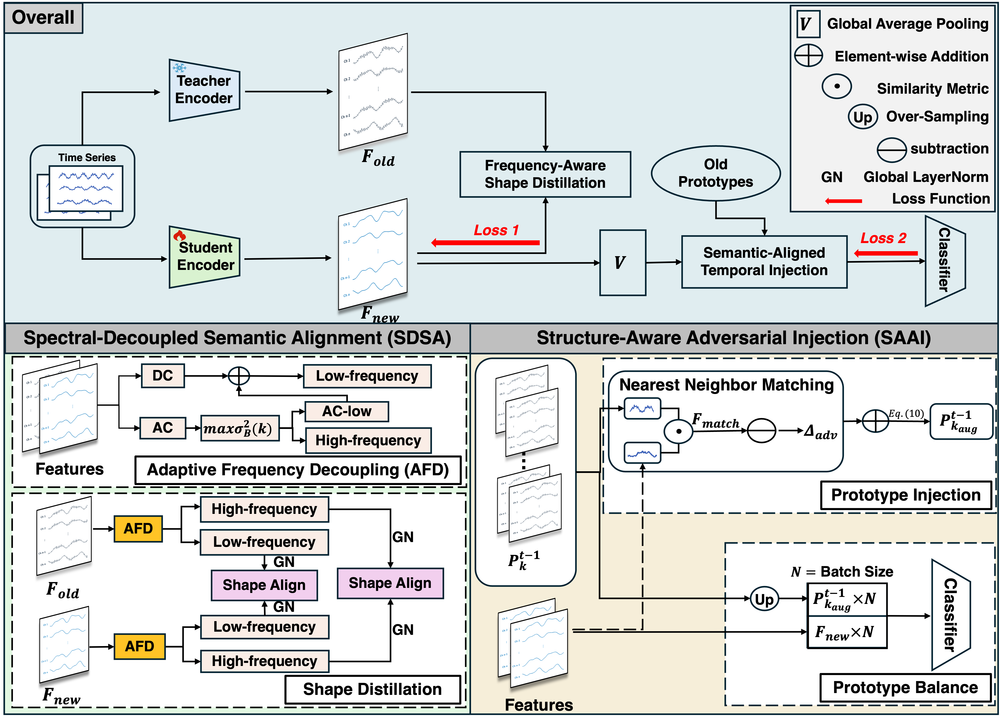
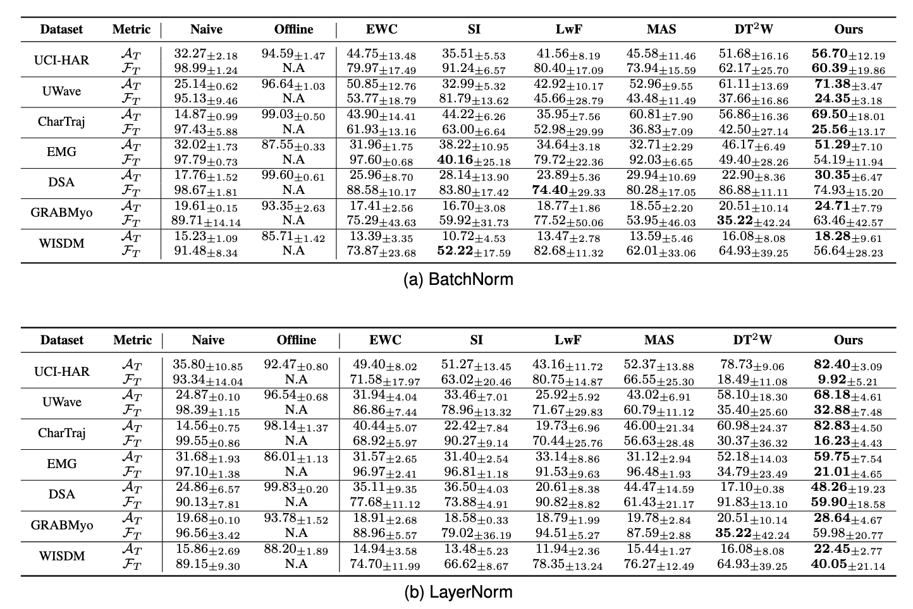

<!-- Improved compatibility of back to top link: See: https://github.com/othneildrew/Best-README-Template/pull/73 -->
<a name="readme-top"></a>
<!--
*** Thanks for checking out the Best-README-Template. If you have a suggestion
*** that would make this better, please fork the repo and create a pull request
*** or simply open an issue with the tag "enhancement".
*** Don't forget to give the project a star!
*** Thanks again! Now go create something AMAZING! :D
-->


<!-- ABOUT THE PROJECT -->
# HiDe: Overcoming Gradient Masking in Time Series Class-incremental Learning via Hierarchical Energy-Shape Decoupling
This is a PyTorch implementation of our work **HiDe: Overcoming Gradient Masking in Time Series Class-incremental Learning via Hierarchical Energy-Shape Decoupling**. **HiDe** is a hierarchical energy-shape decoupling framework designed to tackle catastrophic forgetting in Time Series Non-Exemplar Class-Incremental Learning (TSNECIL). By systematically separating the optimization of feature energy and semantic direction, it effectively transfers structural semantics via **Spectrum-Driven Shape Alignment (SDSA)** and prevents boundary collapse via **Structure-Aware Adversarial Injection (SAAI)**. The code is built on the source code of TSCIL (https://github.com/zqiao11/TSCIL).
## Overview of the Architecture

## Experimental Result



## Requirements


### Create Conda Environment

1. Create the environment from the file
   ```sh
   conda env create -f environment.yml
   ```

2. Activate the environment `tscl`
   ```sh
   conda activate tscl
   ```
----

## Dataset
### Available Datasets
1. [UCI-HAR](https://archive.ics.uci.edu/dataset/240/human+activity+recognition+using+smartphones)
2. [UWAVE](http://www.timeseriesclassification.com/description.php?Dataset=UWaveGestureLibraryAll)
3. [Dailysports](https://archive.ics.uci.edu/ml/datasets/daily+and+sports+activities) 
4. [WISDM](https://archive.ics.uci.edu/dataset/507/wisdm+smartphone+and+smartwatch+activity+and+biometrics+dataset)
5. [GrabMyo](https://physionet.org/content/grabmyo/1.0.2/)
4. [CharTraj](https://www.timeseriesclassification.com/description.php?Dataset=CharacterTrajectories)
5. [EMG](https://archive.ics.uci.edu/dataset/481/emg+data+for+gestures)

### Data Prepareation
We process each dataset individually by executing the corresponding `.py` files located in `data` directory. This process results in the formation of training and test `np.array` data, which are saved as `.pkl` files in `data/saved`. The samples are processed into the shape of (𝐿,𝐶).

For datasets comprising discrete sequences (UCI-HAR, Uwave and Dailysports), we directly use their original raw sequences as samples. For datasets comprising long-term, continuous signals (GrabMyo and WISDM), we apply sliding window techniques to segment these signals into
appropriately shaped samples (downsampling may be applied before window sliding). If the original dataset is not pre-divided into training and testing sets, a manual train-test split will be conducted. Information about the processed data can be found in `utils/setup_elements.py`. The saved data are **not preprocessed with normalization** due to the continual learning setup. Instead, we add a *non-trainable* input normalization layer before the encoder to do the sample-wise normalization. 

For convenience, we provide the processed data files for direct download. Please check the "Setup" part in the "Get Started" section.

### Adding New Dataset
1. Create a new python file in the `data` directory for the new dataset.
2. Format the data into discrete samples in format of numpy array, ensuring each sample maintains the shape of (𝐿,𝐶). Use downsampling or sliding window if needed.
3. If the dataset is not pre-divided into training and test subsets, perform the train-test split manually.
4. Save the numpy arrays of training data, training labels, test data, and test labels into `x_train.pkl`, `state_train.pkl`,`x_test.pkl`, `state_test.pkl` in a new folder in `data/saved`.
5. Finally, add the necessary information of the dataset in `utils/setup_elements.py`.

<p align="right">(<a href="#readme-top">back to top</a>)</p>


## Continual Learning Algorithms
### Existing Algorithms
Regularization-based:
* [LwF](https://arxiv.org/abs/1606.09282)
* [EWC](https://arxiv.org/abs/1612.00796)
* [SI](https://arxiv.org/abs/1703.04200)
* [MAS](https://arxiv.org/abs/1711.09601)
* [DT2W](https://ieeexplore.ieee.org/abstract/document/10094960)
* HiDe(ours)


<!-- GETTING STARTED -->
## Getting Started


### Setup
1. Download the processed data from [Google Drive](https://drive.google.com/drive/folders/1EFdD07myqmqHhRsjeQ83MdF8gHZXDWLR?usp=share_link). Put it into `data/saved` and unzip
   ```sh
   cd data/saved
   unzip <dataset>.zip
   ```
   You can also download the raw datasets and process the data with the corresponding python files.
2. Revise the following configurations to suit your device:
    * `resources` in `tune_hyper_params` in `experiment/tune_and_exp.py` (See [here](https://docs.ray.io/en/latest/tune/tutorials/tune-resources.html) for details)
    * GPU numbers in the `.sh` files in `shell`.

### Run Experiment

There are two functions to run experiments. Set the arguments in the corresponding files or in the command line.

1. Run CIL experiments with custom configurations in `main.config.py`. Note that this function cannot tune/change the hyperparameters for multiple runs. It is recommended for use in sanity checks or debugging.
   ```sh
   python main_config.py
   ```

2. Tune the hyperparameters on the `Val Tasks` first, and then use the best hyperparameters to run experiment on the `Exp Tasks`:
   
   ```sh
   python main_tune.py --data DATA_NAME --agent AGENT_NAME --norm BN/LN
   ```

   To **reproduce the results in the paper**, use the corresponding `.sh` files:
   ```sh
   nohup sh shell/TFusion/{data}_exp.sh &
   ```
   ```sh
   nohup sh shell/TFusion/{data}_exp.sh &
   ```
   ```sh
   nohup sh shell/ablation/{data}_exp.sh &
   ```
    We run the experiment for multiple runs to compute the average performance. In each run, we randomize the class order and tune the best hyperparameters. So the hyperparameters are different across runs. The searching grid of hyperparamteters is set in `experiment/tune_config.py`. Experiment results will be saved as log into `result/tune_and_exp`.


<p align="right">(<a href="#readme-top">back to top</a>)</p>


<!-- MARKDOWN LINKS & IMAGES -->
<!-- https://www.markdownguide.org/basic-syntax/#reference-style-links -->
[contributors-shield]: https://img.shields.io/github/contributors/github_username/repo_name.svg?style=for-the-badge
[contributors-url]: https://github.com/github_username/repo_name/graphs/contributors
[forks-shield]: https://img.shields.io/github/forks/github_username/repo_name.svg?style=for-the-badge
[forks-url]: https://github.com/github_username/repo_name/network/members
[stars-shield]: https://img.shields.io/github/stars/github_username/repo_name.svg?style=for-the-badge
[stars-url]: https://github.com/github_username/repo_name/stargazers
[issues-shield]: https://img.shields.io/github/issues/github_username/repo_name.svg?style=for-the-badge
[issues-url]: https://github.com/github_username/repo_name/issues
[license-shield]: https://img.shields.io/github/license/github_username/repo_name.svg?style=for-the-badge
[license-url]: https://github.com/github_username/repo_name/blob/master/LICENSE.txt
[linkedin-shield]: https://img.shields.io/badge/-LinkedIn-black.svg?style=for-the-badge&logo=linkedin&colorB=555
[linkedin-url]: https://linkedin.com/in/linkedin_username
[product-screenshot]: images/screenshot.png
[Next.js]: https://img.shields.io/badge/next.js-000000?style=for-the-badge&logo=nextdotjs&logoColor=white
[Next-url]: https://nextjs.org/
[React.js]: https://img.shields.io/badge/React-20232A?style=for-the-badge&logo=react&logoColor=61DAFB
[React-url]: https://reactjs.org/
[Vue.js]: https://img.shields.io/badge/Vue.js-35495E?style=for-the-badge&logo=vuedotjs&logoColor=4FC08D
[Vue-url]: https://vuejs.org/
[Angular.io]: https://img.shields.io/badge/Angular-DD0031?style=for-the-badge&logo=angular&logoColor=white
[Angular-url]: https://angular.io/
[Svelte.dev]: https://img.shields.io/badge/Svelte-4A4A55?style=for-the-badge&logo=svelte&logoColor=FF3E00
[Svelte-url]: https://svelte.dev/
[Laravel.com]: https://img.shields.io/badge/Laravel-FF2D20?style=for-the-badge&logo=laravel&logoColor=white
[Laravel-url]: https://laravel.com
[Bootstrap.com]: https://img.shields.io/badge/Bootstrap-563D7C?style=for-the-badge&logo=bootstrap&logoColor=white
[Bootstrap-url]: https://getbootstrap.com
[JQuery.com]: https://img.shields.io/badge/jQuery-0769AD?style=for-the-badge&logo=jquery&logoColor=white
[JQuery-url]: https://jquery.com 
